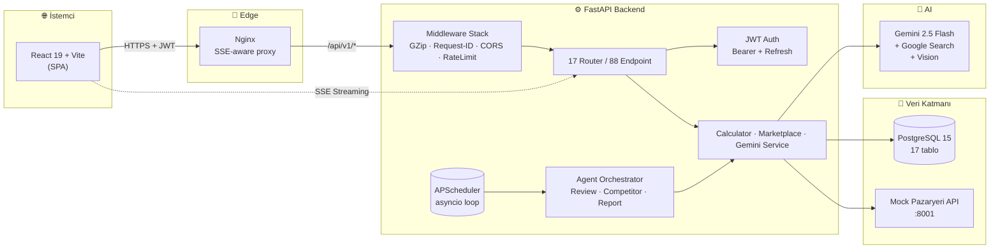
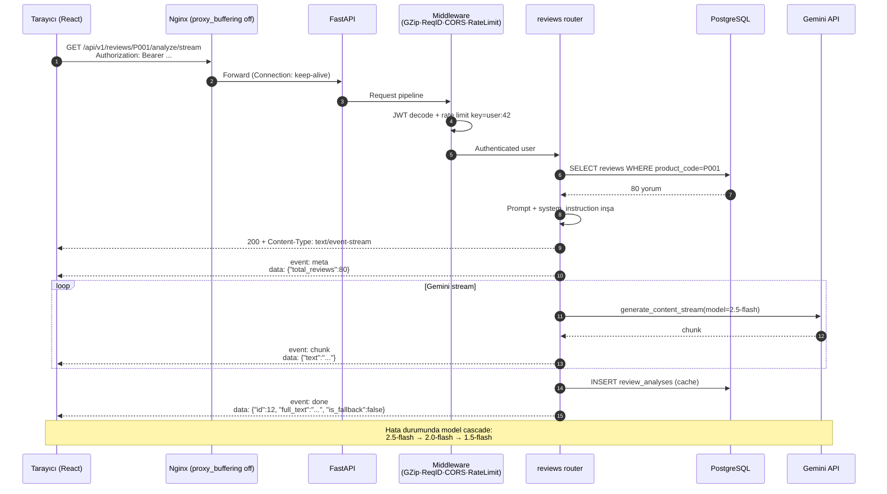
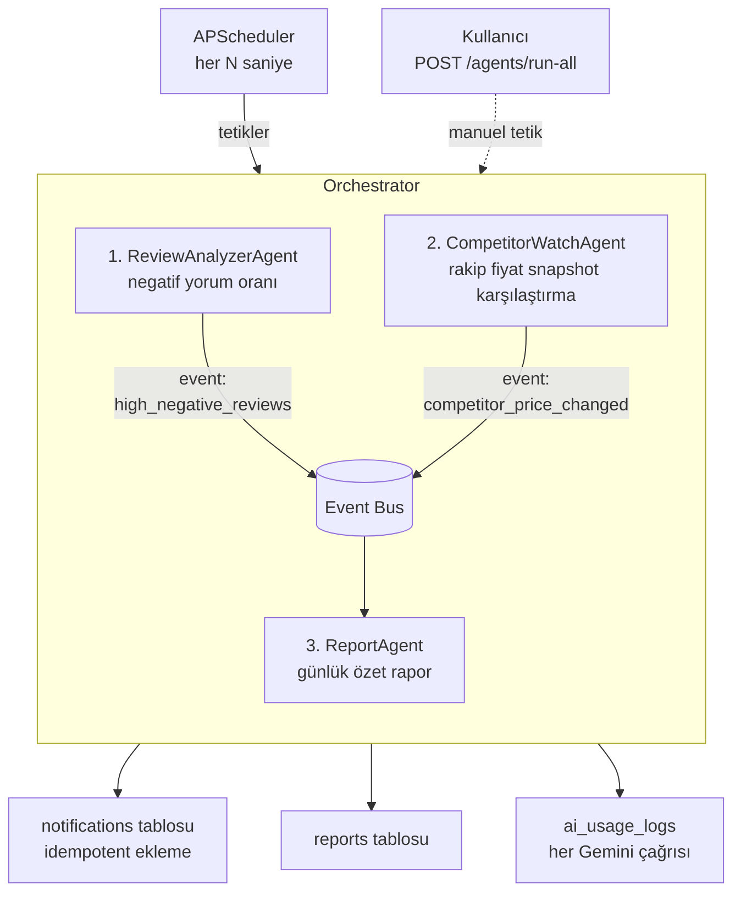
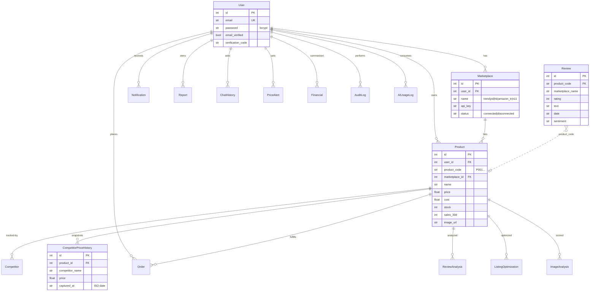

# Arkus AI — Sistem Mimarisi

> **BTK Hackathon 26** değerlendirme kriterlerine göre tasarlanmış, üretim seviyesinde mimari dokümantasyon.
>
> Bu doküman; *neyi*, *nasıl* ve *neden* yaptığımızı tek bakışta jüriye gösterir.

---

## İçindekiler

1. [Tek Sayfada Mimari](#1-tek-sayfada-mimari)
2. [Katmanlı Mimari (4 Layer)](#2-katmanlı-mimari-4-layer)
3. [Modül Haritası (17 Modül / 88 Endpoint)](#3-modül-haritası)
4. [Veri Akışı (Request Lifecycle)](#4-veri-akışı)
5. [Agentic Orkestrasyon](#5-agentic-orkestrasyon)
6. [Veritabanı Şeması (17 Tablo)](#6-veritabanı-şeması)
7. [Teknoloji Stack'i ve Gerekçeler](#7-teknoloji-stacki)
8. [Güvenlik & Üretim Hazırlığı](#8-güvenlik--üretim-hazırlığı)
9. [Performans, Önbellek, Streaming](#9-performans-önbellek-streaming)
10. [BTK Değerlendirme Kriterlerine Eşleme](#10-btk-kriterleri-eşlemesi)

---

## 1. Tek Sayfada Mimari



**Tek satırla:** *React istemci → Nginx → FastAPI → (Calculator + Gemini + Mock API + Postgres) → SSE ile gerçek-zamanlı yanıt.*

---

## 2. Katmanlı Mimari (4 Layer)

> **Separation of concerns**, her katmanın tek bir sorumluluğu var. Bu sayede tek bir Gemini sağlayıcısını değiştirmek (örn. OpenAI) sadece `services/` dizininde tek dosya değişikliği gerektirir.

```
┌─────────────────────────────────────────────────────────────────┐
│  L1 — PRESENTATION (React 19, Vite 8, Tailwind 4)               │
│  • Pages: 21 sayfa, route-level code-splitting                  │
│  • Components: shared/ ui/ layout/ (atomic design)              │
│  • Context: Auth, Toast, i18n (TR/EN)                           │
│  • Streaming UI: StreamingMarkdown + SSE consumer (utils/)      │
└─────────────────────────────────────────────────────────────────┘
                              ▲ HTTPS + JWT Bearer
                              ▼
┌─────────────────────────────────────────────────────────────────┐
│  L2 — APPLICATION (FastAPI Routers + Dependencies)              │
│  • 17 modül, 88 endpoint, hepsi /api/v1 prefix'i altında        │
│  • Middleware: GZip → RequestContext → CORS → RateLimit         │
│  • Dependency injection: get_db, get_current_user (bearer)      │
│  • SSE endpoints: /chat/ask/stream, /reports/*/stream vs.       │
└─────────────────────────────────────────────────────────────────┘
                              ▲ Service çağrıları
                              ▼
┌─────────────────────────────────────────────────────────────────┐
│  L3 — DOMAIN / SERVICES                                          │
│  ┌─────────────┐  ┌─────────────┐  ┌─────────────┐ ┌──────────┐│
│  │ Calculator  │  │ Marketplace │  │ Gemini      │ │ Agents   ││
│  │ • ROAS      │  │ • HTTP mock │  │ • Cascade   │ │ • Review ││
│  │ • Margin    │  │ • DB read   │  │ • Search    │ │ • Comp.  ││
│  │ • Arbitrage │  │ • Sync      │  │ • Vision    │ │ • Report ││
│  │ • Health    │  │             │  │ • Stream    │ │ • Orch.  ││
│  └─────────────┘  └─────────────┘  └─────────────┘ └──────────┘│
└─────────────────────────────────────────────────────────────────┘
                              ▲ SQLAlchemy ORM
                              ▼
┌─────────────────────────────────────────────────────────────────┐
│  L4 — INFRASTRUCTURE                                            │
│  • PostgreSQL 15 (17 tablo, Base.metadata.create_all)           │
│  • Mock Pazaryeri API (FastAPI, port 8001)                      │
│  • Google Gemini API (5 model cascade + Google Search)          │
│  • File storage: UPLOAD_DIR (S3-ready)                          │
│  • Logging: structlog + JSON formatter (Sentry-compatible)      │
└─────────────────────────────────────────────────────────────────┘
```

### Tasarım Prensipleri

| Prensip | Uygulanışı |
|---|---|
| **Dependency Inversion** | Router'lar `services/`'e bağlı; servisler ORM'ye soyut bağlı |
| **Single Source of Truth** | Tüm finansal metrik tek yerde — `services/calculator.py` |
| **Idempotent Operations** | Agent'lar aynı durumda iki kez çalıştırılırsa duplicate bildirim üretmez |
| **Async-Native** | FastAPI async + `run_in_threadpool` ile sync SDK'lar bloklamaz |
| **12-Factor Config** | Tüm yapılandırma `pydantic-settings` ile env'den, hardcode yok |

---

## 3. Modül Haritası

> 17 modül, 88 endpoint, hepsi REST + bazıları SSE.

```
backend/app/
├── routers/                              ← L2: HTTP yüzey
│   ├── auth.py            (10 ep)   🔐  JWT, bcrypt, e-posta doğrulama, sıfırlama
│   ├── store.py           ( 6 ep)   🏪  Pazaryeri bağla/sync/disconnect
│   ├── dashboard.py       ( 5 ep)   📊  Overview · trends · AI summary (SSE)
│   ├── products.py        ( 6 ep)   📦  Listing + arbitraj + low-stock
│   ├── reviews.py         ( 6 ep)   💬  Sentiment + AI analiz (SSE) + filtreli
│   ├── competitors.py     ( 4 ep)   🎯  Rakip + price-map + track
│   ├── arbitrage.py       ( 3 ep)   ⚖️  Çapraz pazaryeri kârlılık
│   ├── financials.py      ( 6 ep)   💰  Overview · by-mp · by-product · cash-flow
│   ├── health_score.py    ( 4 ep)   ❤️  8 kategori, 0-100 skor
│   ├── finance_guide.py   ( 3 ep)   🏦  KOSGEB / KOBİ kredi önerisi (web search)
│   ├── sourcing.py        ( 8 ep)   🌐  Alibaba/1688 toptancı arama + price alert
│   ├── chat.py            ( 3 ep)   🤖  Conversational + function-calling + SSE
│   ├── notifications.py   ( 5 ep)   🔔  Akıllı bildirim üretici (idempotent)
│   ├── reports.py         ( 5 ep)   📋  Daily + weekly + SSE streaming
│   ├── listing_optimizer.py(5 ep)   ✨  Title/desc/keyword + marketplace rules
│   ├── image_analyzer.py  ( 3 ep)   🖼️  Gemini Vision skorlama
│   ├── uploads.py         ( 1 ep)   ⬆️  Multipart image upload
│   ├── agents.py          ( 3 ep)   🤖  Status + manual trigger
│   └── health.py          ( 2 ep)   ❤️‍🩹 Liveness + Readiness
│
├── services/                             ← L3: İş kuralları
│   ├── calculator.py        💡 Tüm finansal hesaplama tek noktada
│   ├── marketplace_api.py   🔌 HTTP client + DB facade
│   └── gemini_service.py    🧠 Cascade + retry + logging + 4 mod
│
├── agents/                               ← L3: Otonom katman
│   ├── base.py            BaseAgent ABC + AgentEvent + AgentResult
│   ├── orchestrator.py    Pipeline + event bus
│   ├── scheduler.py       APScheduler (asyncio loop)
│   ├── arkus_agent.py     Function-calling chat (6 tool)
│   ├── review_analyzer_agent.py
│   ├── competitor_watch_agent.py
│   └── report_agent.py
│
├── db/                                    ← L4: Şema + seed
│   ├── database.py        engine + SessionLocal
│   ├── models.py          17 tablo + ilişkiler
│   └── seed.py            Mock-api'den HTTP ile veri çeker (idempotent)
│
└── (cross-cutting)
    ├── config.py          Pydantic Settings (env validation)
    ├── dependencies.py    get_db, get_current_user
    ├── security.py        bcrypt + JWT (access + refresh)
    ├── rate_limit.py      slowapi (per-user via JWT, per-IP fallback)
    ├── logging_config.py  structlog + RequestContextMiddleware
    ├── audit.py           AuditLog yazıcı (login/key change)
    └── sse.py             SSE helper (event: meta|chunk|done|error)
```

---

## 4. Veri Akışı

> Tek bir AI çağrısının lifecycle'ı — en karmaşık akış olan **Review Analyzer SSE** örneği üzerinden.



### Veri Akışı Garantileri

- **At-most-once delivery for AI write-back:** Stream tamamlanmadan DB'ye yazılmaz; user iptal ederse stale cache oluşmaz.
- **Fallback semantics:** AI hatası `"is_fallback": true` ile işaretlenir, **cache'lenmez** — sahte analiz DB'ye sızmaz.
- **Backpressure:** Nginx `proxy_buffering off` + `X-Accel-Buffering: no` header'ı, SSE token'ları gerçek zamanlı akıtır.

---

## 5. Agentic Orkestrasyon

> Yarışma kuralında "agentic zorunlu değil" yazıyor — biz bilinçli olarak agentic gittik çünkü ürünün ana farkı bu. Reaktif değil, **proaktif** bir e-ticaret asistanı.

### Ajan Pipeline (sıralı, event-driven)



### Conversational Agent (Function-Calling)

`arkus_agent.py` — Gemini'nin tool-use özelliği ile **6 araç** kullanır:

| Tool | Ne yapar | Gerçek DB sorgusu |
|---|---|---|
| `get_store_info(mp)` | Pazaryeri özet metrikleri | ✔ |
| `get_reviews(mp, product_id)` | Filtreli yorum çekme | ✔ |
| `get_all_marketplaces()` | Bağlı MP listesi | ✔ |
| `get_products(mp)` | Ürün listesi + rakipler | ✔ |
| `get_orders(mp)` | Son 500 sipariş | ✔ (bu commit'te eklendi) |
| `get_suppliers()` | Tedarikçi listesi | ✔ |

**Plus:** Context'e ön-hesaplanmış zengin snapshot (en çok satan, en kârlı, düşük stok vs.) inşa edilir — Gemini ekstra tool çağrısı yapmadan soruların ~%80'ine cevap verebilir. Kalan %20'sinde tool kullanır.

### Ajanlar Arası İletişim Örneği

```
ReviewAnalyzerAgent P001 için negatif oranı %47 buldu
        │
        └─→ AgentEvent("high_negative_reviews", {"product_code":"P001", "negative_pct":47})
                │
                └─→ Event Bus'ta birikir
                        │
                        └─→ ReportAgent çalışınca event'leri context'e ekler
                                │
                                └─→ Günlük rapora "Dikkat Edilmesi Gerekenler" başlığı altında ekler
```

---

## 6. Veritabanı Şeması



**17 tablo** — `users`, `sellers`, `marketplace_connections`, `products`, `reviews`, `review_analyses`, `competitors`, `competitor_price_history`, `orders`, `financials`, `notifications`, `reports`, `chat_history`, `price_alerts`, `listing_optimizations`, `image_analyses`, `suppliers`, `audit_logs`, `ai_usage_logs`.

---

## 7. Teknoloji Stack'i

| Katman | Teknoloji | Sürüm | Neden bu? |
|---|---|---|---|
| **Frontend** | React | 19.2 | Server components yok ihtiyacımız, ama 19'un yeni hooks'u (useActionState) form'ları sadeleştiriyor |
| | Vite | 8.0 | Tarihsel olarak en hızlı dev server + en küçük prod bundle |
| | TypeScript | 6.0 | Tip güvenliği, frontend-backend kontratı yazılı |
| | Tailwind CSS | 4.3 | Inline styling, dark mode out-of-box, design tokens CSS var ile |
| | Recharts | 3.8 | React-native chart, custom theming kolay |
| | Axios | 1.16 | Interceptor zinciri ile JWT refresh akışı temiz |
| | react-markdown + remark-gfm | — | AI cevaplarının markdown rendering'i |
| **Backend** | FastAPI | latest | Async-native, Pydantic v2 ile şema validasyonu otomatik |
| | SQLAlchemy 2.x | — | Type-safe ORM, async-ready |
| | PostgreSQL | 15 | JSON sütunları (metrics_json, filters) + güçlü indeksleme |
| | bcrypt | latest | Sektör standardı parola hashleme |
| | PyJWT | latest | Stateless JWT (access + refresh ayrı TTL) |
| | slowapi | latest | Decorator-bazlı rate limit, Redis-ready ama in-memory yeterli |
| | structlog | latest | JSON log, request_id ile traceable |
| **AI** | Google Gemini | 2.5 Flash | Hız + maliyet + Türkçe; cascade fallback'lerle 1.5 Flash'a kadar düşer |
| | Gemini Vision | — | Görsel analizi (mock kullanmıyoruz, gerçek model) |
| | Google Search Grounding | — | Rakip fiyat / KOSGEB / tedarikçi real-time arama |
| **Edge** | Nginx | 1.27 | SPA fallback + SSE-aware reverse proxy (`proxy_buffering off`) |
| **Deploy** | Docker Compose | — | 5 servis: db, mock-api, backend, frontend, adminer |

### Stack Seçim Mantığı

**Neden Gemini'yi cascade ile kullandık?**
Tek modele bağlı olmak prod'da risk — quota dolar veya 503 alır. `MODEL_CASCADE` ile `gemini-2.5-flash` → `gemini-2.0-flash` → `gemini-1.5-flash` otomatik geçer; kullanıcıya "AI çalışmıyor" deme ihtimali %0'a yakın.

**Neden ayrı bir Mock Pazaryeri API?**
Gerçek Trendyol/HB API'sine erişimimiz yok. Ama gerçek entegrasyon **akışını** simüle etmek, ürünü canlıya alındığında sadece `MOCK_MARKETPLACE_API_URL`'i değiştirmemize izin veriyor. Backend kodu hiç dokunulmadan production API'ye geçebilir.

**Neden SSE (WebSocket değil)?**
Ürünün streaming ihtiyacı tek yönlü (server → client). WebSocket gereksiz karmaşıklık; SSE HTTP/2 üzerinde nginx ve Cloud Run gibi sınırlı stateful protokol desteği olan platformlarda sorunsuz çalışır.

---

## 8. Güvenlik & Üretim Hazırlığı

| Konu | Önlem |
|---|---|
| **Parola** | bcrypt, salt otomatik. Eski sha256 hash'leri için "transparent rehash" mantığı (`needs_rehash`) |
| **JWT** | Access (60dk) + Refresh (30gün) ayrı TTL. `production` env'de zayıf secret kullanılırsa **boot crash** |
| **CORS** | Production'da virgül-ayrılmış allowlist; `*` sadece development |
| **Rate Limit** | Per-user (JWT'den `sub`), fallback per-IP. AI endpoint'lerde sıkı (10/dk) |
| **SQL Injection** | SQLAlchemy ORM parametre binding, raw SQL yok |
| **Secret Yönetimi** | `pydantic-settings`, hardcoded secret yok, hepsi `.env` |
| **Audit Trail** | Login, password_change, api_key_change → `audit_logs` tablosu (IP + UA + payload) |
| **Account Enumeration** | `/forgot-password` ve `/verify-email` her zaman aynı mesajı döner |
| **File Upload** | MIME allowlist + 10MB sınırı + UUID dosya adı |
| **AI Cost Tracking** | Her Gemini çağrısı `ai_usage_logs`'a: endpoint, model, süre, hata tipi |

---

## 9. Performans, Önbellek, Streaming

### Performans Stratejileri

```
┌──────────────────────────────────────────────────────────────┐
│  KATMAN              │  STRATEJI                             │
├──────────────────────────────────────────────────────────────┤
│  Frontend Bundle     │  Route-level code splitting (lazy())  │
│  HTTP Compression    │  GZip middleware (>1KB body)          │
│  Static Assets       │  nginx 1y immutable cache             │
│  AI Latency          │  SSE streaming (first byte < 1sn)     │
│  AI Cost             │  ReviewAnalysis 7gün cache            │
│  DB Reads            │  Composite indexes (user_id, date)    │
│  Sync Tools in Async │  run_in_threadpool wrapper            │
│  N+1 Queries         │  joinedload + bulk select             │
│  Agent Idempotency   │  Aynı başlıkta unread varsa skip      │
└──────────────────────────────────────────────────────────────┘
```

### Önbellek Politikası

| Veri | Cache yeri | TTL | Invalidation |
|---|---|---|---|
| Review analizi | `review_analyses` tablosu | 7 gün | `refresh=true` ile bypass |
| AI usage | `ai_usage_logs` | — (sınırsız) | manuel temizlik |
| Dashboard overview | Yok | — | DB her zaman fresh |
| Frontend assets | nginx (1y) | immutable | Build hash ile bypass |

### Streaming Detayı

Backend → Frontend SSE protokolü:

```
event: meta
data: {"snapshot": {...}, "user_id": 42}

event: chunk
data: {"text": "Bu ay marjınız "}

event: chunk
data: {"text": "%18'e geriledi..."}

event: done
data: {"id": 123, "full_text": "...", "model": "gemini-2.5-flash"}
```

Frontend tarafında `utils/streaming.ts` → `streamSSE()` util'i:
- Buffer'lı parse (chunk'ın ortasından kesilen JSON'u sonraki frame'le birleştirir)
- Authorization header otomatik bind
- BASE_URL resolve (Cloud Run + nginx proxy uyumlu)
- onChunk/onMeta/onDone/onError callback'leri

---

## 10. BTK Kriterleri Eşlemesi

> Her kriterin **somut** karşılığı — jüri "nerede?" diye sorduğunda doğrudan dosya/satıra gösterilebilir.

### 🎯 20 puan — Kullanıcı Değeri

| Gerçek satıcı problemi | Arkus AI'nin somut çözümü | Kodda |
|---|---|---|
| Saatler süren yorum okuma | Gemini ile saniyeler içinde özet + kategorize sikayet | [`routers/reviews.py`](backend/app/routers/reviews.py) `/analyze` |
| 4 panel arası gezinme | Tek dashboard'da birleştirilmiş overview | [`routers/dashboard.py`](backend/app/routers/dashboard.py) `/overview` |
| Rakip fiyat manuel takibi | Otomatik snapshot + Google Search canlı fiyat | [`routers/competitors.py`](backend/app/routers/competitors.py) `/analyze?use_web=true` |
| "Ne yapayım?" cevapsızlığı | Her endpoint'te `ai_analysis` ile somut aksiyon önerisi | tüm `*_analyze` route'ları |
| Tedarikçi pazarlık | Sourcing agent Alibaba/1688'de canlı fiyat tarar | [`routers/sourcing.py`](backend/app/routers/sourcing.py) `/real-search` |
| Listing SEO bilgisizliği | Pazaryeri-spesifik kurallarla başlık/keyword/desc | [`routers/listing_optimizer.py`](backend/app/routers/listing_optimizer.py) |
| Görsel kalite kontrol | Gemini Vision ile 0-100 skor + iyileştirme | [`routers/image_analyzer.py`](backend/app/routers/image_analyzer.py) |
| Kredi/finansman cehaleti | KOSGEB/banka için uygunluk skoru + web search | [`routers/finance_guide.py`](backend/app/routers/finance_guide.py) |

**Hedef kitle:** Türkiye'de 600K+ aktif marketplace satıcısı. **Pricing potansiyeli:** aylık ~299₺ SaaS, hedef pazar büyüklüğü ~180M₺/yıl.

### ⚙️ 20 puan — Teknik Puan

- **Mimari:** Katmanlı (4 layer), separation of concerns, dependency injection.
- **Algoritmalar:**
  - Finansal hesaplama: 3 seviye (ürün → pazaryeri → genel), tek noktada
  - Health score: 8 kategori, ağırlıklı skor, deterministic
  - Arbitrage: per-listing margin + opportunity gap hesabı
  - Title SEO analyzer: pazaryeri-spesifik kural motoru + keyword density
- **Frameworks:**
  - FastAPI (async, OpenAPI auto)
  - SQLAlchemy 2.x (type-safe ORM)
  - Pydantic v2 (request/response validation)
  - slowapi (rate limit)
  - structlog (JSON logging)
- **Frontend:** React 19 + TS 6 + Vite 8 + Tailwind 4 (modern stack)
- **Test edilen prod build:** `tsc -b` + `vite build` + `python -m py_compile` hepsi 0 hata
- **88 endpoint, 17 modül, 17 tablo** — yeterli derinlik

### 🎯 10 puan — Performans ve Doğruluk

- **Gemini cascade:** Tek model 503 alırsa otomatik fallback (`gemini_service.py:_try_models`)
- **Strict / non-strict modes:** AI başarısızsa **sahte yanıt üretmez**, açıkça `is_fallback: true` döner
- **Cache invalidation:** Stale cache → manuel `refresh=true` bypass
- **Real-time freshness:** Dashboard her zaman fresh DB okur, AI snapshot ayrı
- **ai_usage_logs:** Her çağrının success/error/duration kaydı → ölçülebilir performans
- **Prompt engineering:**
  - Pazaryeri kurallarını prompt'ta explicit veriyoruz (listing_optimizer)
  - System instruction'da "uydurma, sadece veriden yaz" disclaimer'ı
  - JSON-only çıktı ister → `_try_extract_json` ile fence-stripped parse
- **Google Search Grounding:** Web aramaları için real-time veri (sourcing, finance-guide, competitors)

### 🤖 10 puan — Agentic Yapılar

- **3 otonom ajan + 1 conversational agent** = 4 agentic component
- **APScheduler** ile periyodik tetik (env'den interval, 0 = disable)
- **Event Bus:** Ajanlar `AgentEvent` üretir, sonraki ajanlar context'ine alır
- **Function-calling chat:** Arkus Agent 6 tool ile interaktif veri çekme
- **Idempotent:** Aynı başlıkta unread bildirim varsa skip → spam yok
- **Manuel tetik:** `/agents/run-all` ile demo amaçlı anlık çalıştırma
- **AgentResult contract:** Her ajan `status / items_processed / notifications_created / events` döner — observable

### 💡 10 puan — Yenilikçilik ve Özgünlük

Mevcut piyasada (Roketfy, Brandzone, Vendoo) **olmayan** özelliklerimiz:

1. **Conversational Commerce Intelligence** — Doğal dil sohbet + DB tool-calling
2. **Çapraz Pazaryeri Arbitraj** — Aynı SKU 3 pazaryerinde net kâr karşılaştırması
3. **Otonom Tedarik Avcısı** — Google Search ile canlı Alibaba/1688 fiyat tarama
4. **Gemini Vision Listing Audit** — Ürün fotoğrafına pazaryeri kuralları skoru
5. **KOBİ Finansman Yönlendirme** — KOSGEB/banka eşleştirme + uygunluk skoru
6. **Event-driven Multi-Agent** — Ajanlar birbirini tetikler, kombine analiz üretir

### 🎨 10 puan — Kullanıcı Dostu Çalışma

- **Modern UI:** Tailwind 4 + Glass-morphism, dark mode default, animations (framer-motion)
- **i18n:** TR/EN gerçek çeviri (translations.ts)
- **Streaming UX:** AI cevapları token token akar — kullanıcı boş ekrana bakmaz
- **Optimistic UI:** Login → dashboard'a anlık geçiş, snapshot'lar paralel yüklenir
- **Empty states:** Her sayfada özelleştirilmiş "veri yok" durumları
- **Toast bildirim:** Hata/başarı için non-blocking feedback
- **Mobile responsive:** Sidebar drawer, grid 2→4→6 col breakpoint
- **Code splitting:** Sayfa başına lazy load, initial bundle 121KB gzip

### 🤝 10 puan — Takım Çalışması

- **Net FE/BE ayrımı:** İki taraf bağımsız iterate edebilir, kontrat `types/api.ts` üzerinden
- **Git workflow:** Feature commit'leri ([git log](https://github.com/yunus-ozdemirr/arkus-aii/commits/main))
- **Code review iz:** Her commit anlamlı mesaj + scope (`fix:`, `feat:`)
- **Doküman:** README + bu ARCHITECTURE.md (yapılan iş kâğıt üstünde)

### 🎤 10 puan — Sunum ve İletişim

- **README.md** — kullanıcı odaklı (ne yapar, nasıl çalıştırılır)
- **ARCHITECTURE.md** — bu doküman, jüri odaklı (nasıl tasarlandı)
- **OpenAPI docs** — `/docs` otomatik, 88 endpoint dokümante
- **1 dk demo video** — senaryo hazır (README'de)
- **Mimari diyagramlar** — Mermaid (GitHub'da render olur)
- **Modül haritası** — ASCII tree (her dosyanın amacı tek satırda)
- **Public repo** — [github.com/yunus-ozdemirr/arkus-aii](https://github.com/yunus-ozdemirr/arkus-aii)

---

## Hızlı Başlangıç

```bash
# 1. Repoyu klonla
git clone https://github.com/yunus-ozdemirr/arkus-aii.git
cd arkus-aii

# 2. .env dosyasını oluştur
cp .env.example .env
# GEMINI_API_KEY'i doldur

# 3. Docker Compose ile başlat
docker compose up -d

# 4. Hizmetler hazır
# Frontend:  http://localhost:3000
# Backend:   http://localhost:8000/docs
# Mock API:  http://localhost:8001/docs
# DB Admin:  http://localhost:8080  (Adminer)

# 5. Demo hesabı
# email: demo@arkus.ai
# pass:  demo123
```

---

<div align="center">

**Arkus AI** — Sen sorma. O söylesin.

[](https://react.dev)
[](https://fastapi.tiangolo.com)
[](https://ai.google.dev)
[](https://www.postgresql.org)
[](https://docs.docker.com/compose/)

</div>
