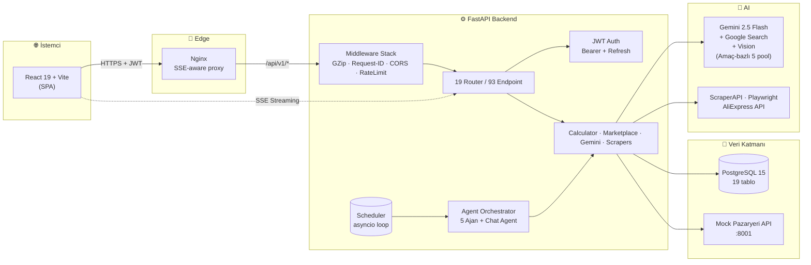
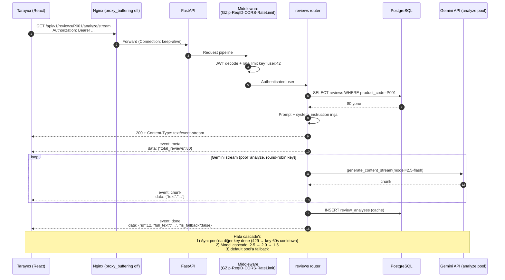
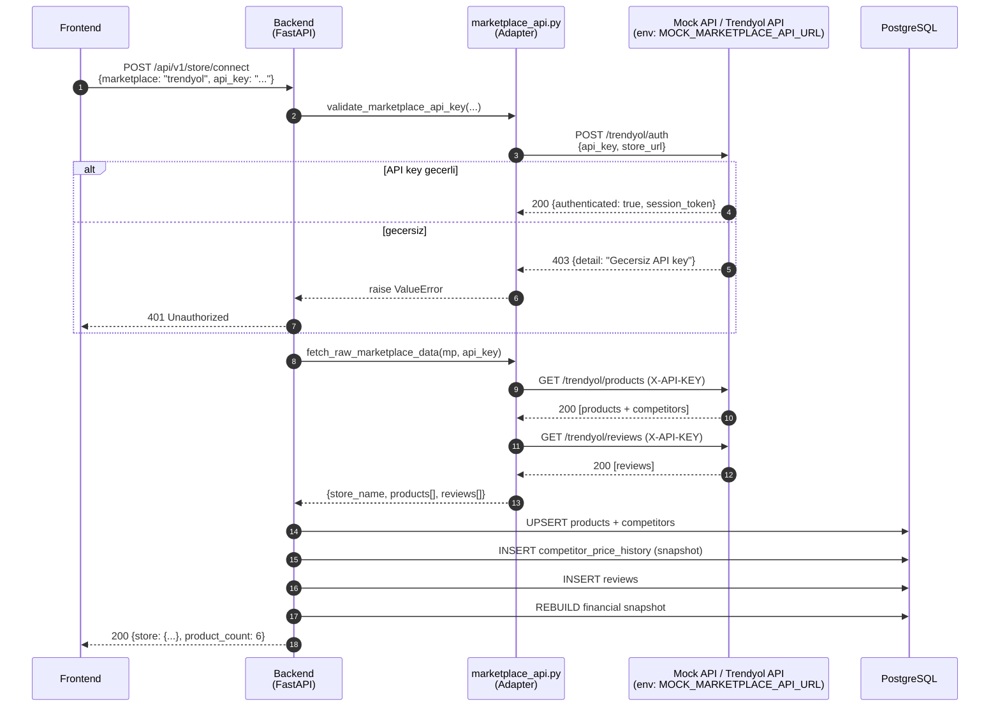
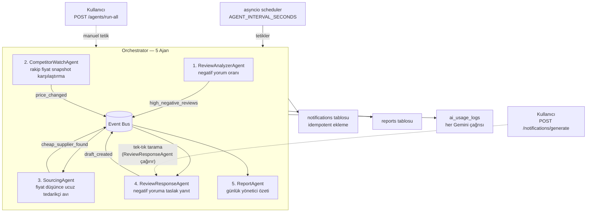
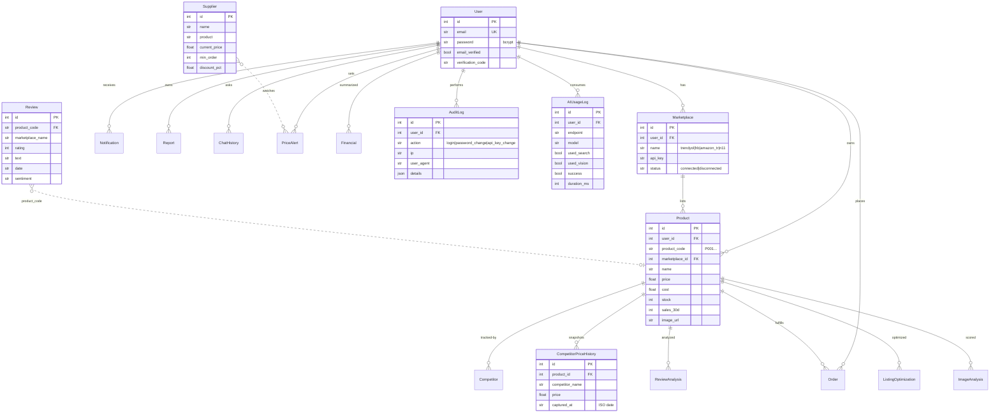
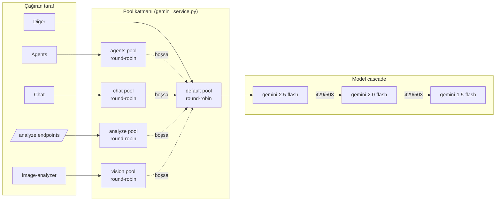
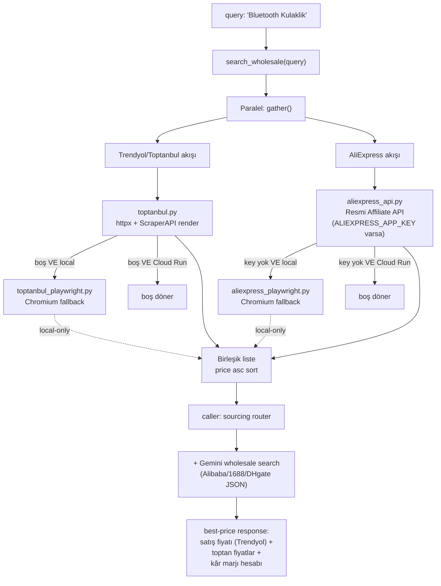
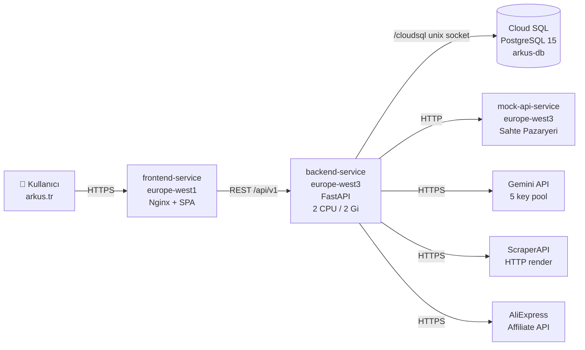
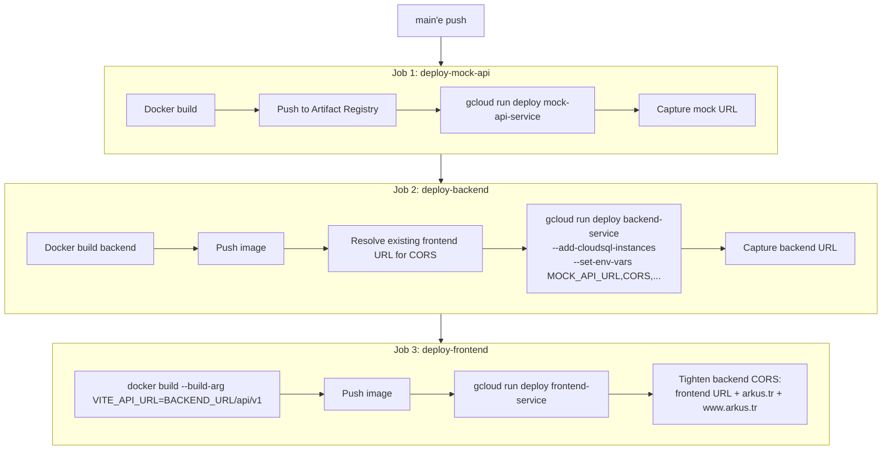
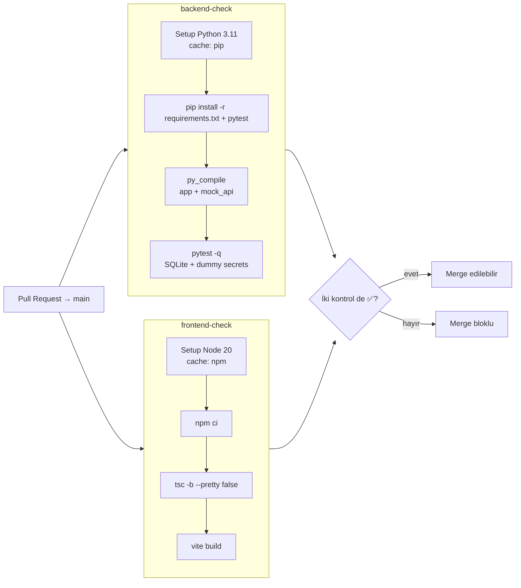

# Arkus AI — Sistem Mimarisi

> **BTK Hackathon 26** değerlendirme kriterlerine göre tasarlanmış, üretim seviyesinde mimari dokümantasyon.
>
> Bu doküman; *neyi*, *nasıl* ve *neden* yaptığımızı tek bakışta jüriye gösterir.
>
> 🌐 **Canlı:** [https://arkus.tr](https://arkus.tr)

---

## İçindekiler

1. [Tek Sayfada Mimari](#1-tek-sayfada-mimari)
2. [Katmanlı Mimari (4 Layer)](#2-katmanlı-mimari-4-layer)
3. [Modül Haritası (17 Modül / 19 Router / 93 Endpoint)](#3-modül-haritası)
4. [Veri Akışı (Request Lifecycle)](#4-veri-akışı)
4.5 [Marketplace API Adapter (Mock → Prod)](#45-marketplace-api-adapter-mock--prod-geçiş)
5. [Agentic Orkestrasyon (5 Ajan + Chat Agent)](#5-agentic-orkestrasyon)
6. [Veritabanı Şeması (19 Tablo)](#6-veritabanı-şeması)
7. [Teknoloji Stack'i ve Gerekçeler](#7-teknoloji-stacki)
8. [Güvenlik & Üretim Hazırlığı](#8-güvenlik--üretim-hazırlığı)
9. [Performans, Önbellek, Streaming](#9-performans-önbellek-streaming)
10. [BTK Değerlendirme Kriterlerine Eşleme](#10-btk-kriterleri-eşlemesi)
11. [Tedarik Avcısı Mimarisi & Web Scraping](#11-tedarik-avcısı-mimarisi--web-scraping)
12. [Production Deployment & CI/CD](#12-production-deployment--cicd)

---

## 1. Tek Sayfada Mimari



**Tek satırla:** *React istemci → Nginx → FastAPI → (Calculator + Gemini havuzu + Mock API + Scrapers + Postgres) → SSE ile gerçek-zamanlı yanıt.*

---

## 2. Katmanlı Mimari (4 Layer)

> **Separation of concerns**, her katmanın tek bir sorumluluğu var. Bu sayede tek bir Gemini sağlayıcısını değiştirmek (örn. OpenAI) sadece `services/` dizininde tek dosya değişikliği gerektirir.

```
┌─────────────────────────────────────────────────────────────────┐
│  L1 — PRESENTATION (React 19, Vite, Tailwind 4)                 │
│  • Pages: 24 sayfa, route-level code-splitting                  │
│  • Components: shared/ ui/ layout/ (ConfirmDialog dahil)        │
│  • Context: Auth, Toast, I18n (TR/EN), Analysis                 │
│  • Streaming UI: StreamingMarkdown + SSE consumer (utils/)      │
└─────────────────────────────────────────────────────────────────┘
                              ▲ HTTPS + JWT Bearer
                              ▼
┌─────────────────────────────────────────────────────────────────┐
│  L2 — APPLICATION (FastAPI Routers + Dependencies)              │
│  • 19 router, 93 endpoint, hepsi /api/v1 prefix'i altında       │
│  • Middleware: GZip → RequestContext → CORS → RateLimit         │
│  • Dependency injection: get_db, get_current_user (bearer)      │
│  • SSE endpoints: /chat/ask/stream, /reports/*/stream vs.       │
└─────────────────────────────────────────────────────────────────┘
                              ▲ Service çağrıları
                              ▼
┌─────────────────────────────────────────────────────────────────┐
│  L3 — DOMAIN / SERVICES                                          │
│  ┌─────────────┐ ┌─────────────┐ ┌─────────────┐ ┌────────────┐ │
│  │ Calculator  │ │ Marketplace │ │ Gemini      │ │ Scrapers/  │ │
│  │ • ROAS      │ │ • HTTP mock │ │ • 5 Pool    │ │ ScraperAPI │ │
│  │ • Margin    │ │ • DB read   │ │ • Cascade   │ │ Playwright │ │
│  │ • Arbitrage │ │ • Sync      │ │ • Search    │ │ AliExpress │ │
│  │ • Health    │ │             │ │ • Vision    │ │            │ │
│  └─────────────┘ └─────────────┘ └─────────────┘ └────────────┘ │
│  ┌──────────────────────────────────────────────────────────┐   │
│  │ Agents — 5 ajan + Chat Agent (orchestrator + scheduler)  │   │
│  │ ReviewAnalyzer · CompetitorWatch · Sourcing              │   │
│  │ ReviewResponse · Report · arkus_agent (function-calling) │   │
│  └──────────────────────────────────────────────────────────┘   │
└─────────────────────────────────────────────────────────────────┘
                              ▲ SQLAlchemy ORM
                              ▼
┌─────────────────────────────────────────────────────────────────┐
│  L4 — INFRASTRUCTURE                                            │
│  • PostgreSQL 15 (19 tablo, Base.metadata.create_all)           │
│  • Mock Pazaryeri API (FastAPI, port 8001)                      │
│  • Google Gemini API (model cascade + amaç-bazlı 5 pool)        │
│  • ScraperAPI HTTP render · Playwright (sadece local)           │
│  • File storage: UPLOAD_DIR (S3-ready)                          │
│  • Logging: structlog + JSON formatter (Sentry-compatible)      │
└─────────────────────────────────────────────────────────────────┘
```

### Tasarım Prensipleri

| Prensip | Uygulanışı |
|---|---|
| **Dependency Inversion** | Router'lar `services/`'e bağlı; servisler ORM'ye soyut bağlı |
| **Single Source of Truth** | Tüm finansal metrik tek yerde — `services/calculator.py` |
| **Idempotent Operations** | Agent'lar aynı durumda iki kez çalıştırılırsa duplicate bildirim üretmez |
| **Async-Native** | FastAPI async + `run_in_threadpool` ile sync SDK'lar bloklamaz |
| **12-Factor Config** | Tüm yapılandırma `pydantic-settings` ile env'den, hardcode yok |

---

## 3. Modül Haritası

> 17 işlevsel modül, 19 router (uploads + health dahil), 93 endpoint. Hepsi REST + bazıları SSE.

```
backend/app/
├── routers/                              ← L2: HTTP yüzey
│   ├── auth.py            (10 ep)   🔐  JWT, bcrypt, e-posta doğrulama, sıfırlama
│   ├── store.py           ( 6 ep)   🏪  Pazaryeri bağla/sync/disconnect
│   ├── dashboard.py       ( 5 ep)   📊  Overview · trends · AI summary (SSE)
│   ├── products.py        ( 6 ep)   📦  Listing + arbitraj + low-stock
│   ├── reviews.py         ( 7 ep)   💬  Sentiment + AI analiz (SSE) + filtreli
│   ├── competitors.py     ( 4 ep)   🎯  Rakip + price-map + track
│   ├── arbitrage.py       ( 3 ep)   ⚖️  Çapraz pazaryeri kârlılık
│   ├── financials.py      ( 7 ep)   💰  Full · overview · by-mp · by-product · cash-flow
│   ├── health_score.py    ( 4 ep)   ❤️  8 kategori, 0-100 skor
│   ├── finance_guide.py   ( 3 ep)   🏦  KOSGEB / KOBİ kredi önerisi (web search + fallback)
│   ├── sourcing.py        ( 8 ep)   🌐  Alibaba/1688 toptancı arama + price alert
│   ├── chat.py            ( 4 ep)   🤖  Conversational + function-calling + SSE
│   ├── notifications.py   ( 5 ep)   🔔  Akıllı bildirim üretici (idempotent, ajan tetik)
│   ├── reports.py         ( 7 ep)   📋  Daily + weekly + SSE + DELETE
│   ├── listing_optimizer.py(5 ep)   ✨  Title/desc/keyword + marketplace rules
│   ├── image_analyzer.py  ( 3 ep)   🖼️  Gemini Vision skorlama
│   ├── uploads.py         ( 1 ep)   ⬆️  Multipart image upload
│   ├── agents.py          ( 3 ep)   🤖  Status + manual trigger
│   └── health.py          ( 2 ep)   ❤️‍🩹 Liveness + Readiness
│
├── services/                             ← L3: İş kuralları
│   ├── calculator.py        💡 Tüm finansal hesaplama tek noktada
│   ├── marketplace_api.py   🔌 HTTP client + DB facade
│   ├── gemini_service.py    🧠 Amaç-bazlı 5 pool + cascade + retry + logging
│   └── scrapers/            🕸️ Web scraping zinciri
│       ├── toptanbul.py             ScraperAPI HTTP render (Trendyol)
│       ├── toptanbul_playwright.py  Playwright fallback (sadece local)
│       ├── aliexpress_api.py        Resmi AliExpress Affiliate API
│       ├── aliexpress_playwright.py Playwright fallback (sadece local)
│       ├── currency.py              USD/CNY → TL kur dönüşümü
│       └── __init__.py              search_wholesale() orkestratörü
│
├── agents/                               ← L3: Otonom katman (5 ajan + chat)
│   ├── base.py               BaseAgent ABC + AgentEvent + AgentResult
│   ├── orchestrator.py       Pipeline + event bus (5 ajan sıralı)
│   ├── scheduler.py          asyncio scheduler (AGENT_INTERVAL_SECONDS)
│   ├── arkus_agent.py        Function-calling chat (6 tool, pipeline dışı)
│   ├── review_analyzer_agent.py
│   ├── competitor_watch_agent.py
│   ├── sourcing_agent.py            ← yeni: ucuz tedarikçi avı (price_changed event)
│   ├── review_response_agent.py     ← yeni: negatif yoruma taslak yanıt
│   └── report_agent.py
│
├── db/                                    ← L4: Şema + seed
│   ├── database.py        engine + SessionLocal
│   ├── models.py          19 tablo + ilişkiler
│   └── seed.py            Mock-api'den HTTP ile veri çeker (idempotent)
│
├── mock_api/                              ← Production-ready adapter
│   ├── main.py            Trendyol/HB/Amazon-TR/N11 endpoint simülasyonu
│   └── Dockerfile         Ayrı Cloud Run servisi
│
└── (cross-cutting)
    ├── config.py          Pydantic Settings (env validation, JWT strength)
    ├── dependencies.py    get_db, get_current_user
    ├── security.py        bcrypt + JWT (access + refresh)
    ├── rate_limit.py      slowapi (per-user via JWT, per-IP fallback)
    ├── logging_config.py  structlog + RequestContextMiddleware
    ├── audit.py           AuditLog yazıcı (login/key change)
    └── sse.py             SSE helper (event: meta|chunk|done|error)
```

---

## 4. Veri Akışı

> Tek bir AI çağrısının lifecycle'ı — en karmaşık akış olan **Review Analyzer SSE** örneği üzerinden.



### Veri Akışı Garantileri

- **At-most-once delivery for AI write-back:** Stream tamamlanmadan DB'ye yazılmaz; user iptal ederse stale cache oluşmaz.
- **Fallback semantics:** AI hatası `"is_fallback": true` ile işaretlenir, **cache'lenmez** — sahte analiz DB'ya sızmaz.
- **Backpressure:** Nginx `proxy_buffering off` + `X-Accel-Buffering: no` header'ı, SSE token'ları gerçek zamanlı akıtır.
- **Pool isolation:** Chat ve analyze pool'ları ayrı — demoda chat quota'sı, yorum analiz fırtınasıyla tükenmez.

---

## 4.5. Marketplace API Adapter (Mock → Prod Geçiş)

> Bu mimarinin **en kritik production-readiness sinyali**: gerçek satıcı paneli API'lerine erişimimiz yok ama kod tarafı sanki varmış gibi yazıldı.

### Neden Mock?

Hackathon süresinde Trendyol/Hepsiburada/Amazon TR/N11 **satıcı paneli** (Seller Center) API'larına erişimimiz yok — bu API'ler sadece doğrulanmış kurumsal satıcılara, haftalar süren başvuru süreçleriyle açılır. Demo amaçlı public endpoint'ler de yetersiz: çünkü bu projenin kalbi **satıcının kendi mağazasının** verisi (ürünleri, yorumları, komisyonu, ROAS'i).

Bu sebeple **3-katmanlı bir adapter pattern** kurduk:

```
gerçek pazaryeri API  ←→  marketplace_api.py adapter  ←→  Backend route'lar
       (yok)                  (HTTP client)              (calculator, agents)
                                    │
                                    ▼  fallback (env: MOCK_MARKETPLACE_API_URL)
                                    
                              mock-api (port 8001)
                              gerçek API yapısının
                                 birebir kopyası
```

### Mimari Karar: Tek HTTP İletişim Noktası

Tüm pazaryeri HTTP çağrıları **tek bir dosyada** toplandı:

| Fonksiyon (`backend/app/services/marketplace_api.py`) | Sorumluluk |
|---|---|
| `fetch_raw_marketplace_data(marketplace, api_key)` | Ürünler + rakipler + yorumlar — tek HTTP turuna sığar |
| `validate_marketplace_api_key(marketplace, api_key, store_url)` | Sync öncesi auth check |
| `fetch_*` (DB okuyucular) | Sync sonrası hızlı route cevapları için ORM tarafı |

Bu sayede gerçek API'ye geçişte **TEK dosyada** değişiklik yeter.

### Endpoint Eşleme Tablosu

Mock-api endpoint'leri, gerçek Trendyol satıcı paneli API'siyle birebir aynı pattern'i izler:

| Mock (`localhost:8001`) | Trendyol Production Karşılığı | Auth | Notlar |
|---|---|---|---|
| `POST /{slug}/auth` | OAuth/HMAC handshake | API key body | 403 = invalid key |
| `GET /{slug}/store-info` | `sapigw.trendyol.com/suppliers/{id}` | `X-API-KEY` | store_name, rating, komisyon |
| `GET /{slug}/products` | `sapigw.trendyol.com/suppliers/{id}/products` | `X-API-KEY` | + rakipler embedded |
| `GET /{slug}/reviews?product_id=` | `sapigw.trendyol.com/suppliers/{id}/q&a` | `X-API-KEY` | Filtre opsiyonel |

URL slug ↔ internal name eşlemesi: `trendyol`↔`trendyol`, `hepsiburada`↔`hepsiburada`, `amazon-tr`↔`amazon_tr` (URL'de dash, DB'de underscore), `n11`↔`n11`.

### Sequence: Pazaryeri Bağlama Akışı



### Production'a Geçiş Checklist'i

Hackathon → MVP → Production geçişi için bu adımlar yeterli — başka kod değişikliği gerekmez:

1. **Env değişkeni güncellemesi**
   ```bash
   # .env (production)
   MOCK_MARKETPLACE_API_URL=https://api.trendyol.com/sapigw
   ```

2. **Demo key havuzu çıkarılır**
   - `marketplace_api.py:DEMO_KEYS` dict'i kaldırılır
   - `req.api_key` (kullanıcının kendi gerçek key'i) tek kaynak olur
   - `/api/v1/store/connect` zaten `api_key` parametresi alıyor — frontend değişmez

3. **Pazaryeri-spesifik auth dispatch** (opsiyonel — sadece HB OAuth gibi karmaşık auth gerekirse)
   - `marketplace_api.py` içinde basit if/elif branching → her marketplace için custom client method

4. **Rate limit / retry** (opsiyonel)
   - `httpx` zaten 429 alır; mevcut log mantığı yeterli
   - Gerçek API quota'sı sıkıysa `tenacity` retry decorator eklenebilir

5. **Per-marketplace özel response field'ları** (gerekirse)
   - `_normalize_response()` helper'ı eklenir, ama Trendyol/HB/Amazon TR şeması zaten %90+ benzer

### Adapter Pattern'in Faydaları

| Fayda | Etki |
|---|---|
| **Frontend değişmez** | UI sadece backend endpoint'lerini bilir |
| **Agent katmanı değişmez** | Ajanlar `marketplace_api.fetch_*` çağrılarını kullanır, kaynak kim umurunda değil |
| **Calculator/Gemini değişmez** | Saf fonksiyonlar, input formatı sabit |
| **Test edilebilirlik** | Mock-api Docker'la her yerde ayağa kalkar — CI test'ler dış servise bağımlı değil |
| **Çoklu pazaryeri** | Yeni bir pazaryeri eklemek: `MP_SLUG` dict'e bir satır + mock-api'ye 1 entry |

---

## 5. Agentic Orkestrasyon

> Yarışma kuralında "agentic zorunlu değil" yazıyor — biz bilinçli olarak agentic gittik çünkü ürünün ana farkı bu. Reaktif değil, **proaktif** bir e-ticaret asistanı.

### Ajan Pipeline (sıralı, event-driven)



### 5 Ajan — Sorumluluklar

| Ajan | Tetikleyici | Cikti / Event |
|---|---|---|
| **ReviewAnalyzerAgent** | Periyodik / yeni yorum | `%40+` negatif → bildirim + `high_negative_reviews` |
| **CompetitorWatchAgent** | Periyodik | Snapshot karşılaştırma `%3+/%5+` → bildirim + `price_changed` |
| **SourcingAgent** | `price_changed` event'i | AliExpress / Trendyol toptan arama; daha ucuz alternatif bulunca bildirim |
| **ReviewResponseAgent** | `high_negative_reviews` event'i + manuel tetik | Negatif yoruma 3-4 cümlelik profesyonel taslak (`yorum_cevap_taslagi` notification) |
| **ReportAgent** | Günlük / manuel | Tüm event'leri context'e alıp yönetici özeti üretir |

> **Önemli:** "Bildirimleri Tara" butonu (`/api/v1/notifications/generate`) artık 4 klasik tarama (stok/puan/rakip/indirim) **ve** `ReviewResponseAgent`'ı tek seferde çalıştırır — kullanıcı 1 saatlik scheduler tick'ini beklemez.

### Conversational Agent (Function-Calling)

`arkus_agent.py` — Gemini'nin tool-use özelliği ile **6 araç** kullanır:

| Tool | Ne yapar | Gerçek DB sorgusu |
|---|---|---|
| `get_store_info(mp)` | Pazaryeri özet metrikleri | ✔ |
| `get_reviews(mp, product_id)` | Filtreli yorum çekme | ✔ |
| `get_all_marketplaces()` | Bağlı MP listesi | ✔ |
| `get_products(mp)` | Ürün listesi + rakipler | ✔ |
| `get_orders(mp)` | Son 500 sipariş | ✔ |
| `get_suppliers()` | Tedarikçi listesi | ✔ |

**Plus:** Context'e ön-hesaplanmış zengin snapshot (en çok satan, en kârlı, düşük stok vs.) inşa edilir — Gemini ekstra tool çağrısı yapmadan soruların ~%80'ine cevap verebilir. Kalan %20'sinde tool kullanır. Bu ajan pipeline'da **değildir**; `/api/v1/chat` endpoint'i tarafından çağrılır, `chat` pool'undan key alır.

### Ajanlar Arası İletişim Örneği

```
ReviewAnalyzerAgent P001 için negatif oranı %47 buldu
        │
        ├─→ AgentEvent("high_negative_reviews", {"product_code":"P001", "negative_pct":47})
        │           │
        │           └─→ ReviewResponseAgent → o ürünün ≤2★ yorumlarına taslak yanıt üretir
        │
        ▼
CompetitorWatchAgent rakip fiyatını %8 düşürdü tespit etti
        │
        └─→ AgentEvent("price_changed", {"product_id":12, "diff_pct":-8})
                    │
                    └─→ SourcingAgent → Alibaba/AliExpress'te daha ucuz toptan arıyor
                                │
                                └─→ Bulduysa: "Marjı koruyalım, X TL'ye yeni tedarikçi var"
                                
ReportAgent çalışınca event listesini günlük rapora "Dikkat Edilmesi Gerekenler" altına ekler
```

---

## 6. Veritabanı Şeması



### 19 Tablo — Tam Liste

| # | Tablo | Amaç |
|---|---|---|
| 1 | `users` | Kayıt, kimlik, e-posta doğrulama, şifre sıfırlama token'ı |
| 2 | `sellers` | Mock-api seed verisi (legacy seller info — backward compat) |
| 3 | `marketplace_connections` | Bağlı pazaryeri + API key + sync status |
| 4 | `products` | Ürün kataloğu (pazaryeri başına) |
| 5 | `reviews` | Müşteri yorumları (rating + text + sentiment) |
| 6 | `review_analyses` | AI yorum analiz cache (7 gün TTL) |
| 7 | `competitors` | Ürün bazlı rakip snapshot'ı |
| 8 | `competitor_price_history` | Günlük rakip fiyat snapshot'ları (trend analizi) |
| 9 | `orders` | Son siparişler (son 500) |
| 10 | `financials` | Aylık finansal snapshot (revenue, profit, ROAS) |
| 11 | `notifications` | Akıllı bildirimler (idempotent: aynı title + unread → skip) |
| 12 | `reports` | Daily + weekly raporlar (metrics + AI içerik) |
| 13 | `chat_history` | AI Chat sohbet kayıtları (last_n soru-cevap) |
| 14 | `price_alerts` | Kullanıcının tedarikçi fiyat alarm tanımları |
| 15 | `listing_optimizations` | Title/keyword/description AI optimizasyon geçmişi |
| 16 | `image_analyses` | Gemini Vision skor + öneri geçmişi |
| 17 | `suppliers` | Toptan tedarikçi kataloğu (scraping + AI bulgusu) |
| 18 | `audit_logs` | Güvenlik denetim izi (login, password_change, key_change) |
| 19 | `ai_usage_logs` | Her Gemini çağrısı (endpoint, model, süre, hata tipi) — ölçülebilir maliyet |

---

## 7. Teknoloji Stack'i

| Katman | Teknoloji | Neden bu? |
|---|---|---|
| **Frontend** | React 19 | Yeni hooks (useActionState) form'ları sadeleştiriyor |
| | Vite | En hızlı dev server + en küçük prod bundle |
| | TypeScript | Tip güvenliği, frontend-backend kontratı yazılı |
| | Tailwind CSS 4 | Inline styling, dark mode out-of-box, design tokens CSS var ile |
| | Recharts | React-native chart, custom theming kolay |
| | Framer Motion | Smooth modal/transition animasyonu |
| | Axios | Interceptor zinciri ile JWT refresh akışı temiz |
| | react-router 7 | Lazy route-level code splitting |
| | react-markdown + remark-gfm | AI cevaplarının markdown rendering'i |
| **Backend** | FastAPI | Async-native, Pydantic v2 ile şema validasyonu otomatik |
| | SQLAlchemy 2.x | Type-safe ORM, async-ready |
| | PostgreSQL 15 | JSON sütunları (metrics_json, filters) + güçlü indeksleme |
| | bcrypt | Sektör standardı parola hashleme |
| | PyJWT | Stateless JWT (access + refresh ayrı TTL) |
| | slowapi | Decorator-bazlı rate limit, Redis-ready ama in-memory yeterli |
| | structlog | JSON log, request_id ile traceable |
| **AI** | Google Gemini 2.5 Flash | Hız + maliyet + Türkçe; cascade fallback'lerle 1.5 Flash'a kadar düşer |
| | Gemini Vision | Görsel analizi (mock değil, gerçek model) |
| | Google Search Grounding | Rakip fiyat / KOSGEB / tedarikçi real-time arama |
| **Web Scraping** | ScraperAPI | HTTP render API — Cloud Run uyumlu (Chromium yok) |
| | Playwright + stealth | Local'de JS-render fallback (Trendyol, AliExpress) |
| | curl_cffi | TLS fingerprint randomization (bot-tespiti azaltır) |
| | BeautifulSoup / lxml | HTML parse |
| | AliExpress Affiliate API | Resmi DS API (key varsa öncelikli) |
| **Edge** | Nginx | SPA fallback + SSE-aware reverse proxy (`proxy_buffering off`) |
| **Deploy** | Docker Compose | Local: 5 servis (db, mock-api, backend, frontend, adminer) |
| | Google Cloud Run | Production: 3 servis (mock-api, backend, frontend) |
| | Cloud SQL | Production PostgreSQL |
| | GitHub Actions | CI/CD (deploy.yml + pr-checks.yml) |

### 7.1. Gemini API Key Havuzu (Amaç-Bazlı Pool)

Tek bir Gemini key'ine bağlı kalmak production'da risk: hızlı 429 (quota), demo sırasında chat'in askıda kalması. Çözüm: **5 ayrı pool**, her biri ayrı kullanım amacı için.



**Kurallar:**

| Davranış | Açıklama |
|---|---|
| Round-robin | Her pool içinde key'ler dairesel kullanılır (`itertools.cycle`) |
| 429 cooldown | Quota hatası alan key 60 sn kara listeye alınır; sıra atlanır |
| Pool tükendi | Tüm key'ler cooldown ise → ilgili pool **default** pool'a fallback |
| Default boş | Hiç key yok → `client=None`, çağıran "AI unavailable" döner (sahte data değil) |
| Model cascade | Her key'de model sırayla denenir: 2.5 → 2.0 → 1.5 |
| Thread-safe | Pool init + iterator advance `_lock` ile korunur |
| Backward compat | Eski `pool` parametresi geçmeyen caller'lar `default`'a düşer |

**Env değişkenleri** (`backend/app/config.py`):

```bash
# Tek-key (legacy, sadece bu varsa → default pool)
GEMINI_API_KEY=AIza...

# Amaç-bazlı havuzlar (virgülle ayrılmış)
GEMINI_API_KEYS_AGENTS=AIza_a1,AIza_a2,AIza_a3
GEMINI_API_KEYS_CHAT=AIza_c1,AIza_c2          # demo'da kritik
GEMINI_API_KEYS_ANALYZE=AIza_n1,AIza_n2
GEMINI_API_KEYS_VISION=AIza_v1
GEMINI_API_KEYS_DEFAULT=AIza_d1,AIza_d2       # boş bırakılan diğer pool'lar için
```

Bu sayede demoda kullanıcı AI Chat'te sorular sorarken, arka planda 5 ajan çalışsa bile `chat` pool'u izole olduğu için **kullanıcı asla quota'ya çarpmaz**.

### Stack Seçim Mantığı

**Neden Gemini'yi cascade + havuz ile kullandık?**
Tek modele bağlı olmak prod'da risk — quota dolar veya 503 alır. Hem model cascade (`gemini-2.5-flash` → `gemini-2.0-flash` → `gemini-1.5-flash`) hem 5 izole key havuzu ile kullanıcıya "AI çalışmıyor" deme ihtimali %0'a yakın.

**Neden ayrı bir Mock Pazaryeri API?**
Gerçek Trendyol/HB API'sine erişimimiz yok. Ama gerçek entegrasyon **akışını** simüle etmek, ürün canlıya alındığında sadece `MOCK_MARKETPLACE_API_URL`'i değiştirmemize izin veriyor. Backend kodu hiç dokunulmadan production API'ye geçebilir.

**Neden SSE (WebSocket değil)?**
Ürünün streaming ihtiyacı tek yönlü (server → client). WebSocket gereksiz karmaşıklık; SSE HTTP/2 üzerinde nginx ve Cloud Run gibi sınırlı stateful protokol desteği olan platformlarda sorunsuz çalışır.

**Neden ScraperAPI + Playwright çift katman?**
Cloud Run instance'larında Chromium ~300-500 MB bellek yer → 2Gi limiti zorlar (OOM 503). Production'da `SCRAPER_API_KEY` set olunca Chromium fallback'leri devre dışı kalır; sadece HTTP render kullanılır. Local'de key yoksa Playwright tam güçle çalışır.

---

## 8. Güvenlik & Üretim Hazırlığı

| Konu | Önlem |
|---|---|
| **Parola** | bcrypt, salt otomatik. Eski sha256 hash'leri için "transparent rehash" mantığı (`needs_rehash`) |
| **JWT** | Access (60dk) + Refresh (30gün) ayrı TTL. `production` env'de zayıf secret kullanılırsa **boot crash** (`_INSECURE_JWT_DEFAULTS` validator) |
| **CORS** | Production'da virgül-ayrılmış allowlist (deploy.yml frontend URL + `arkus.tr` + `www.arkus.tr` ile sıkılaştırır); `*` sadece development |
| **Rate Limit** | Per-user (JWT'den `sub`), fallback per-IP. AI endpoint'lerde sıkı (10/dk) |
| **SQL Injection** | SQLAlchemy ORM parametre binding, raw SQL yok |
| **Secret Yönetimi** | `pydantic-settings`, hardcoded secret yok, hepsi `.env` veya GitHub Secrets |
| **Audit Trail** | Login, password_change, api_key_change → `audit_logs` tablosu (IP + UA + payload) |
| **Account Enumeration** | `/forgot-password` ve `/verify-email` her zaman aynı mesajı döner |
| **File Upload** | MIME allowlist + 10MB sınırı + UUID dosya adı |
| **AI Cost Tracking** | Her Gemini çağrısı `ai_usage_logs`'a: endpoint, model, süre, hata tipi |
| **API Key Pool** | 429 alan key 60 sn cooldown — DOS'a karşı self-healing |

---

## 9. Performans, Önbellek, Streaming

### Performans Stratejileri

```
┌──────────────────────────────────────────────────────────────┐
│  KATMAN              │  STRATEJI                             │
├──────────────────────────────────────────────────────────────┤
│  Frontend Bundle     │  Route-level code splitting (lazy())  │
│  HTTP Compression    │  GZip middleware (>1KB body)          │
│  Static Assets       │  nginx 1y immutable cache             │
│  AI Latency          │  SSE streaming (first byte < 1sn)     │
│  AI Cost             │  ReviewAnalysis 7gün cache            │
│  Financials Page     │  /financials/full → 5 endpoint → 1    │
│  DB Reads            │  Composite indexes (user_id, date)    │
│  Sync Tools in Async │  run_in_threadpool wrapper            │
│  N+1 Queries         │  joinedload + bulk select             │
│  Agent Idempotency   │  Aynı başlıkta unread varsa skip      │
│  Gemini Quota        │  5 pool izolasyon + 60s key cooldown  │
└──────────────────────────────────────────────────────────────┘
```

### Önbellek Politikası

| Veri | Cache yeri | TTL | Invalidation |
|---|---|---|---|
| Review analizi | `review_analyses` tablosu | 7 gün | `refresh=true` ile bypass |
| AI usage | `ai_usage_logs` | — (sınırsız) | manuel temizlik |
| Dashboard overview | Yok | — | DB her zaman fresh |
| Frontend assets | nginx (1y) | immutable | Build hash ile bypass |
| Gemini client | Per-key, modül-level | Process ömrü | Pool re-init ile reset |

### Streaming Detayı

Backend → Frontend SSE protokolü:

```
event: meta
data: {"snapshot": {...}, "user_id": 42}

event: chunk
data: {"text": "Bu ay marjınız "}

event: chunk
data: {"text": "%18'e geriledi..."}

event: done
data: {"id": 123, "full_text": "...", "model": "gemini-2.5-flash"}
```

Frontend tarafında `utils/streaming.ts` → `streamSSE()` util'i:
- Buffer'lı parse (chunk'ın ortasından kesilen JSON'u sonraki frame'le birleştirir)
- Authorization header otomatik bind
- BASE_URL resolve (Cloud Run + nginx proxy uyumlu)
- onChunk/onMeta/onDone/onError callback'leri

---

## 10. BTK Kriterleri Eşlemesi

> Her kriterin **somut** karşılığı — jüri "nerede?" diye sorduğunda doğrudan dosya/satıra gösterilebilir.

### 🎯 20 puan — Kullanıcı Değeri

| Gerçek satıcı problemi | Arkus AI'nin somut çözümü | Kodda |
|---|---|---|
| Saatler süren yorum okuma | Gemini ile saniyeler içinde özet + kategorize sikayet | [`routers/reviews.py`](backend/app/routers/reviews.py) `/analyze` |
| 4 panel arası gezinme | Tek dashboard'da birleştirilmiş overview | [`routers/dashboard.py`](backend/app/routers/dashboard.py) `/overview` |
| Rakip fiyat manuel takibi | Otomatik snapshot + Google Search canlı fiyat | [`routers/competitors.py`](backend/app/routers/competitors.py) `/analyze?use_web=true` |
| "Ne yapayım?" cevapsızlığı | Her endpoint'te `ai_analysis` ile somut aksiyon önerisi | tüm `*_analyze` route'ları |
| Tedarikçi pazarlık | Sourcing agent Alibaba/1688/AliExpress canlı fiyat tarar | [`routers/sourcing.py`](backend/app/routers/sourcing.py) `/real-search` |
| Negatif yorum stresi | ReviewResponseAgent profesyonel taslak yanıt üretir | [`agents/review_response_agent.py`](backend/app/agents/review_response_agent.py) |
| Listing SEO bilgisizliği | Pazaryeri-spesifik kurallarla başlık/keyword/desc | [`routers/listing_optimizer.py`](backend/app/routers/listing_optimizer.py) |
| Görsel kalite kontrol | Gemini Vision ile 0-100 skor + iyileştirme | [`routers/image_analyzer.py`](backend/app/routers/image_analyzer.py) |
| Kredi/finansman cehaleti | KOSGEB/banka için uygunluk skoru + web search + güvenli fallback | [`routers/finance_guide.py`](backend/app/routers/finance_guide.py) |

**Hedef kitle:** Türkiye'de 600K+ aktif marketplace satıcısı. **Pricing potansiyeli:** aylık ~299₺ SaaS, hedef pazar büyüklüğü ~180M₺/yıl.

### ⚙️ 20 puan — Teknik Puan

- **Mimari:** Katmanlı (4 layer), separation of concerns, dependency injection.
- **Algoritmalar:**
  - Finansal hesaplama: 3 seviye (ürün → pazaryeri → genel), tek noktada
  - Health score: 8 kategori, ağırlıklı skor, deterministic
  - Arbitrage: per-listing margin + opportunity gap hesabı
  - Title SEO analyzer: pazaryeri-spesifik kural motoru + keyword density
  - Gemini key pool: round-robin + 60s cooldown + cascade
- **Frameworks:**
  - FastAPI (async, OpenAPI auto)
  - SQLAlchemy 2.x (type-safe ORM)
  - Pydantic v2 (request/response validation)
  - slowapi (rate limit)
  - structlog (JSON logging)
- **Frontend:** React 19 + TS + Vite + Tailwind 4 (modern stack)
- **Production:** Google Cloud Run (3 servis) + Cloud SQL — gerçek deploy, [https://arkus.tr](https://arkus.tr)
- **CI/CD:** GitHub Actions iki workflow — `pr-checks.yml` gating + `deploy.yml` otomatik release
- **Test edilen prod build:** `tsc -b` + `vite build` + `python -m py_compile` + `pytest -q` → CI'da gating
- **19 router · 93 endpoint · 19 tablo · 5 ajan** — yeterli derinlik

### 🎯 10 puan — Performans ve Doğruluk

- **Gemini cascade:** Tek model 503 alırsa otomatik fallback (`gemini_service.py:_try_models`)
- **Gemini key havuzu:** 5 pool izolasyon + 429 → 60 sn cooldown — chat asla quota'ya takılmaz
- **Strict / non-strict modes:** AI başarısızsa **sahte yanıt üretmez**, açıkça `is_fallback: true` döner
- **Cache invalidation:** Stale cache → manuel `refresh=true` bypass
- **Real-time freshness:** Dashboard her zaman fresh DB okur, AI snapshot ayrı
- **ai_usage_logs:** Her çağrının success/error/duration kaydı → ölçülebilir performans
- **FinanceGuide defansif fallback:** Gemini 20s'de cevap vermezse hardcoded KOSGEB/Halkbank/Ziraat listesi → kullanıcı asla boş ekran görmez
- **Financials performans:** 5 paralel endpoint → tek `/full` çağrısı (4 marketplace senaryosunda 4-6s → 1-1.5s)
- **Prompt engineering:**
  - Pazaryeri kurallarını prompt'ta explicit veriyoruz (listing_optimizer)
  - System instruction'da "uydurma, sadece veriden yaz" disclaimer'ı
  - JSON-only çıktı ister → `_try_extract_json` ile fence-stripped parse, token kesilmiş JSON için tolerant recovery
- **Google Search Grounding:** Web aramaları için real-time veri (sourcing, finance-guide, competitors)

### 🤖 10 puan — Agentic Yapılar

- **5 otonom ajan + 1 conversational agent** = 6 agentic component
- **Asyncio scheduler** ile periyodik tetik (env'den interval, 0 = disable)
- **Event Bus:** Ajanlar `AgentEvent` üretir, sonraki ajanlar context'ine alır (`price_changed` → SourcingAgent; `high_negative_reviews` → ReviewResponseAgent)
- **Function-calling chat:** Arkus Agent 6 tool ile interaktif veri çekme
- **Idempotent:** Aynı başlıkta unread bildirim varsa skip → spam yok
- **Manuel tetik:** `/agents/run-all` ile demo amaçlı anlık çalıştırma; `/notifications/generate` artık ReviewResponseAgent'ı da çağırır
- **AgentResult contract:** Her ajan `status / items_processed / notifications_created / events` döner — observable

### 💡 10 puan — Yenilikçilik ve Özgünlük

Mevcut piyasada (Roketfy, Brandzone, Vendoo) **olmayan** özelliklerimiz:

1. **Conversational Commerce Intelligence** — Doğal dil sohbet + DB tool-calling
2. **Çapraz Pazaryeri Arbitraj** — Aynı SKU 3 pazaryerinde net kâr karşılaştırması
3. **Otonom Tedarik Avcısı** — ScraperAPI + Playwright + AliExpress API + Gemini Search ile canlı Alibaba/1688 fiyat tarama
4. **Negatif Yoruma AI Cevap Taslağı** — ReviewResponseAgent, satıcı taslağı kopyala-yapıştır kullanır
5. **Gemini Vision Listing Audit** — Ürün fotoğrafına pazaryeri kuralları skoru
6. **KOBİ Finansman Yönlendirme** — KOSGEB/banka eşleştirme + uygunluk skoru + defansif fallback
7. **Event-driven Multi-Agent** — Ajanlar birbirini tetikler, kombine analiz üretir
8. **Amaç-bazlı Gemini Key Havuzu** — Chat / agents / analyze / vision pool izolasyonu

### 🎨 10 puan — Kullanıcı Dostu Çalışma

- **Modern UI:** Tailwind 4 + Glass-morphism, dark mode default, animations (framer-motion)
- **i18n:** TR/EN gerçek çeviri (translations.ts)
- **Streaming UX:** AI cevapları token token akar — kullanıcı boş ekrana bakmaz
- **Optimistic UI:** Login → dashboard'a anlık geçiş, snapshot'lar paralel yüklenir
- **Empty states:** Her sayfada özelleştirilmiş "veri yok" durumları
- **Toast bildirim:** Hata/başarı için non-blocking feedback
- **ConfirmDialog:** Rapor silme gibi yıkıcı işlemlerde ortak onay modalı (ESC, backdrop, danger variant)
- **Mobile responsive:** Sidebar drawer, grid 2→4→6 col breakpoint
- **Code splitting:** Sayfa başına lazy load
- **Privacy/Terms:** KVKK uyumlu yasal sayfalar (`/privacy`, `/terms`) — landing footer'dan erişilir

### 🤝 10 puan — Takım Çalışması

- **Net FE/BE ayrımı:** İki taraf bağımsız iterate edebilir, kontrat `types/api.ts` üzerinden
- **Git workflow:** Feature commit'leri ([git log](https://github.com/yunus-ozdemirr/arkus-aii/commits/main))
- **PR CI gating:** `pr-checks.yml` — backend `py_compile` + `pytest` ve frontend `tsc` + `vite build` geçmeden merge edilemez
- **Code review iz:** Her commit anlamlı mesaj + scope (`fix:`, `feat:`)
- **Doküman:** README + bu ARCHITECTURE.md (yapılan iş kâğıt üstünde)

### 🎤 10 puan — Sunum ve İletişim

- **README.md** — kullanıcı odaklı (ne yapar, nasıl çalıştırılır, canlı link)
- **ARCHITECTURE.md** — bu doküman, jüri odaklı (nasıl tasarlandı)
- **OpenAPI docs** — `/docs` otomatik, 93 endpoint dokümante
- **Canlı demo** — [https://arkus.tr](https://arkus.tr) (production deploy)
- **1 dk demo video** — senaryo hazır (README'de)
- **Mimari diyagramlar** — Mermaid (GitHub'da render olur)
- **Modül haritası** — ASCII tree (her dosyanın amacı tek satırda)
- **Public repo** — [github.com/yunus-ozdemirr/arkus-aii](https://github.com/yunus-ozdemirr/arkus-aii)

---

## 11. Tedarik Avcısı Mimarisi & Web Scraping

> **Sorun:** Bir e-ticaret satıcısı için en kritik kaldıraç: aynı ürünü daha ucuza tedarik etmek. Ama Alibaba / 1688 / AliExpress / DHgate sayfaları JavaScript-rendered ve bot-engelli; basit `requests.get` ile gelmez.

### Çoklu-Katman Arama Zinciri

`backend/app/services/scrapers/__init__.py:search_wholesale()` paralel iki kaynağı dener; her kaynak kendi içinde **httpx → Playwright** fallback'i kullanır.



### Production vs Local Stratejisi

`SCRAPER_API_KEY` ortam değişkeni varlığı → production sinyali:

| | Local (`SCRAPER_API_KEY` boş) | Production (`SCRAPER_API_KEY` set) |
|---|---|---|
| Trendyol (toptanbul) | httpx direkt → boşsa Playwright | ScraperAPI HTTP render — Playwright **devre dışı** |
| AliExpress | Affiliate API → boşsa Playwright | Affiliate API — Playwright **devre dışı** |
| Bellek | ~500MB (Chromium aktif) | ~150MB (sadece HTTP) |
| Hız | Yavaş (Chromium start ~3s) | Hızlı (HTTP render ~1s) |
| Neden | Tam kapsama | Cloud Run 2Gi OOM koruması |

### Gemini Wholesale Search (3. Katman)

Scraper'lar tükenirse `routers/sourcing.py:_gemini_wholesale_search()` devreye girer:

- **Prompt:** Alibaba, 1688, DHgate, AliExpress (toptan), Turkish wholesalers
- **MOQ filtresi:** ≥ 50 adet (gerçek B2B)
- **Tolerant JSON parser:** Token limit yüzünden kesilmiş JSON'u kurtarır (`re.search(r'\[.*\]', ...)`)
- **Çoklu anahtar denemesi:** Gemini bazen Türkçe key döner — 8 farklı alias dener (`name|tedarikci|firma|site|...`)
- **Currency normalizasyonu:** USD/CNY → TL (`scrapers/currency.py`)
- **Self-healing URL:** Geçersiz/eksik URL → Google search fallback URL

### Frontend Sunumu

Sonuçlar `SourcingPage.tsx`'te **iki tab** halinde sunulur:

| Tab | Veri Kaynağı | Kullanıcıya Sinyal |
|---|---|---|
| **Satış Fiyatı** | Trendyol perakende (toptanbul scraper) | "Pazarda bu ürün ortalama X TL satılıyor" |
| **Toptancı Fiyatları** | AliExpress + Gemini (Alibaba/1688/DHgate) | "MOQ 50+ ile bu fiyatlara temin edebilirsin" |

Üstte **Kâr Marjı Analizi** kartı: ort. satış − en ucuz toptan = tahmini kâr/adet + marj %.

---

## 12. Production Deployment & CI/CD

> Canlı URL: **[https://arkus.tr](https://arkus.tr)** — Google Cloud Run üzerinde 3 servis + Cloud SQL.

### 12.1. Cloud Run Topolojisi



| Servis | Bölge | Port | Kaynak | Not |
|---|---|---|---|---|
| `mock-api-service` | europe-west3 | 8001 | 1 CPU / 512 Mi | Trendyol/HB/Amazon/N11 simülasyonu |
| `backend-service` | europe-west3 | 8080 | 2 CPU / 2 Gi | Cloud SQL'e `--add-cloudsql-instances` ile bağlı |
| `frontend-service` | europe-west1 | 8080 | 1 CPU / 512 Mi | Nginx + statik build (Vite); `VITE_API_URL` build-time gömülü |

Cloud SQL instance: `gen-lang-client-0173678969:europe-west3:arkus-db` (PostgreSQL 15).

### 12.2. `deploy.yml` Pipeline (main'e push)



**Önemli detaylar:**

- **VITE_API_URL build-arg:** Vite `import.meta.env.VITE_API_URL` build-time'da gömüldüğü için Dockerfile'a `--build-arg` ile gerçek backend URL'i geçilir. Runtime env değişikliği işe yaramaz.
- **CORS sıkılaştırma:** İlk deploy'da `CORS_ORIGINS=*` ile başlar; frontend deploy bittikten sonra `^|^` delimiter syntax'ı ile `frontend-service-url,https://arkus.tr,https://www.arkus.tr` olarak update edilir.
- **Cloud SQL bağlantısı:** `--add-cloudsql-instances=gen-lang-client-0173678969:europe-west3:arkus-db` + `DATABASE_URL=postgresql+psycopg://...?host=/cloudsql/<instance>`
- **`^|^` env-vars delimiter:** Virgül içeren CORS değeri için gcloud'un default `,` ayırıcısını override eder.

### 12.3. `pr-checks.yml` — CI Gating

`main`'e açılan her PR'da iki paralel iş çalışır:



**Test ortamı (pytest):**
```bash
DATABASE_URL=sqlite:///./test.db        # gerçek Postgres'e ihtiyaç yok
JWT_SECRET=ci-test-secret-32-chars-min-length-ok
GEMINI_API_KEY=''                       # AI çağrıları skip
APP_ENV=development                     # JWT validator geçer
AGENT_INTERVAL_SECONDS=0                # scheduler off
CORS_ORIGINS=*
```

### 12.4. GitHub Secrets Tablosu

`deploy.yml`'in ihtiyaç duyduğu secret'lar:

| Secret | Kaynak | Amaç |
|---|---|---|
| `GCP_PROJECT_ID` | GCP Console | Proje hedefi |
| `GCP_SA_KEY` | Service Account JSON | Cloud Run Admin + Artifact Registry Writer |
| `JWT_SECRET` | rastgele 32+ karakter | Production JWT; zayıfsa boot crash |
| `DATABASE_URL` | Cloud SQL bağlantı string'i | `postgresql+psycopg://user:pwd@/db?host=/cloudsql/<instance>` |
| `GEMINI_API_KEY` | AI Studio | Tek-key fallback (default pool) |
| `GEMINI_API_KEYS_AGENTS` | AI Studio (n key) | Agent pool (virgülle ayrılmış) |
| `GEMINI_API_KEYS_CHAT` | AI Studio (n key) | Chat pool — demo sırasında izole |
| `GEMINI_API_KEYS_ANALYZE` | AI Studio (n key) | Analyze endpoint'leri |
| `GEMINI_API_KEYS_VISION` | AI Studio (n key) | Image-analyzer |
| `GEMINI_API_KEYS_DEFAULT` | AI Studio (n key) | Diğer pool'lar boş kalırsa fallback |
| `SCRAPER_API_KEY` | scraperapi.com | Production'da JS-render; Playwright'i devre dışı bırakır |

### 12.5. Local vs Production Env Farkları

| Değişken | Local (docker compose) | Production (Cloud Run) |
|---|---|---|
| `APP_ENV` | `development` | `production` |
| `DATABASE_URL` | `postgresql://arkus:arkuspassword@db:5432/arkus_db` | Cloud SQL unix socket |
| `MOCK_MARKETPLACE_API_URL` | `http://mock-api:8001` | mock-api-service Cloud Run URL |
| `CORS_ORIGINS` | `*` | `https://arkus.tr,https://www.arkus.tr,<frontend-service-url>` |
| `SCRAPER_API_KEY` | Boş (Playwright fallback aktif) | Set (Chromium kapalı, HTTP render) |
| `AGENT_INTERVAL_SECONDS` | `3600` (veya `0` testte) | `3600` |
| Gemini pool'lar | Tek `GEMINI_API_KEY` yetebilir | 5 ayrı pool secret'ları |
| Frontend → Backend | `http://localhost:8000/api/v1` | `https://backend-service-xxx.run.app/api/v1` (build-arg) |
| Frontend URL | `http://localhost:3000` | `https://arkus.tr` |

### 12.6. Deploy Akışı Garantileri

| Garanti | Nasıl sağlanır |
|---|---|
| **Atomic deploy** | Cloud Run revision rollout — yeni revision sağlıklı olunca trafik geçer |
| **Zero downtime** | Cloud Run gradual rollout (default) |
| **Health probes** | `/health` (liveness) + `/readiness` endpoint'leri (`routers/health.py`) |
| **Cold start** | `--cpu 2 --memory 2Gi` + Cloud SQL connection pooling |
| **Secret hijack koruması** | Service account JSON GitHub Secret olarak şifrelenmiş; CI loglarda görünmez |
| **Rollback** | Cloud Run console'dan tek tıkla önceki revision'a dönüş |
| **Cost control** | Pay-per-request; idle'da 0 instance; `min-instances=0` default |

---

## Hızlı Başlangıç

```bash
# 1. Repoyu klonla
git clone https://github.com/yunus-ozdemirr/arkus-aii.git
cd arkus-aii

# 2. .env dosyasını oluştur
cp .env.example .env
# GEMINI_API_KEY'i doldur

# 3. Docker Compose ile başlat
docker compose up -d

# 4. Hizmetler hazır
# Frontend:  http://localhost:3000
# Backend:   http://localhost:8000/docs
# Mock API:  http://localhost:8001/docs
# DB Admin:  http://localhost:8080  (Adminer)
# Production: https://arkus.tr

# 5. Demo hesabı
# email: demo@arkus.ai
# pass:  demo123
```

---

<div align="center">

**Arkus AI** — Sen sorma. O söylesin.

🌐 **[https://arkus.tr](https://arkus.tr)**

[](https://react.dev)
[](https://fastapi.tiangolo.com)
[](https://ai.google.dev)
[](https://www.postgresql.org)
[](https://cloud.google.com/run)
[](https://docs.docker.com/compose/)

</div>
